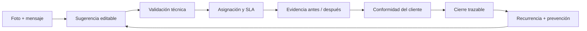
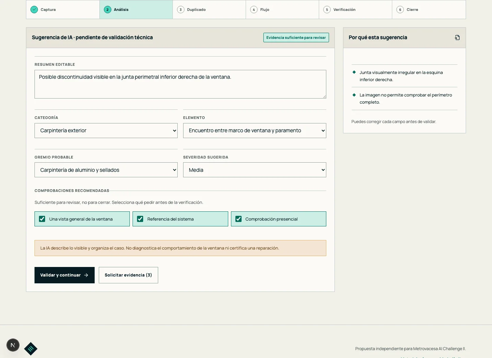
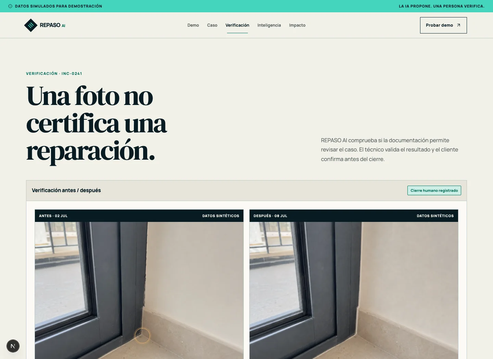
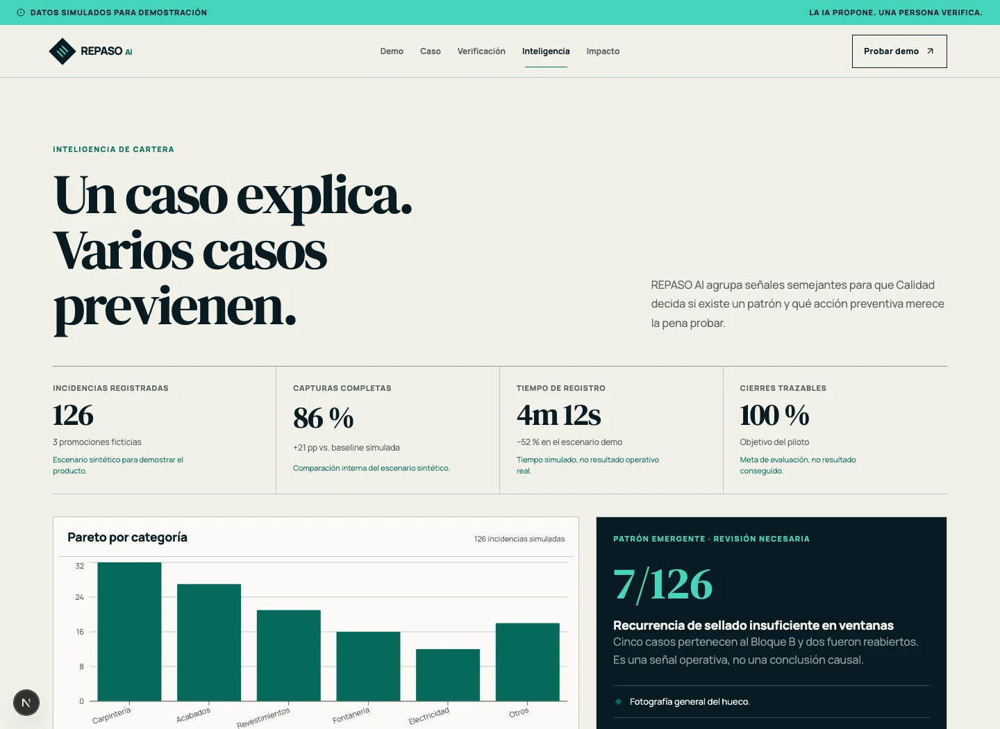
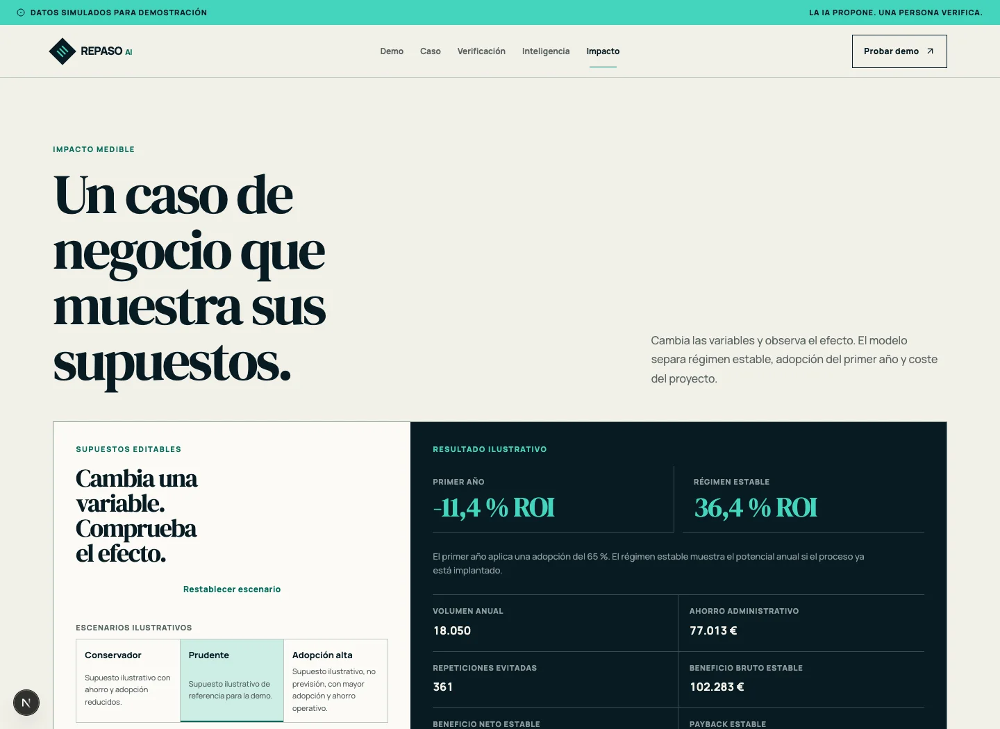
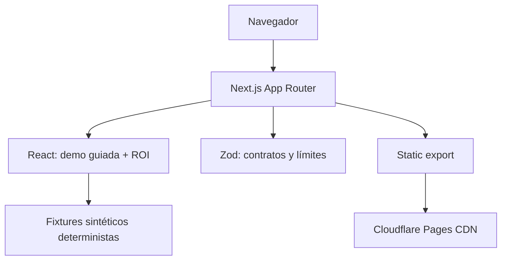

# Software con IA para gestionar incidencias de obra y postventa inmobiliaria

## REPASO AI: de la foto al cierre técnico verificado

[](https://repaso-ai.pages.dev/)
[](https://github.com/Hiberius/software-gestion-incidencias-obra-postventa-ia/actions/workflows/ci.yml)
[](https://github.com/Hiberius/software-gestion-incidencias-obra-postventa-ia/actions/workflows/codeql.yml)
[](https://nextjs.org/)
[](https://pages.cloudflare.com/)
[](https://nodejs.org/)


**REPASO AI es una demo funcional de software para gestionar incidencias de obra, preentrega y postventa inmobiliaria con inteligencia artificial.** Convierte una fotografía, un mensaje o un documento incompleto en una incidencia revisable; conserva la decisión técnica humana; exige evidencia antes del cierre; y devuelve lo aprendido al proceso como recurrencia, checklist o acción preventiva.

Está pensada para promotoras, constructoras, direcciones facultativas y equipos de calidad o postventa que necesitan reducir información incompleta, reasignaciones, cierres débiles y defectos repetitivos. No es una promesa de automatización total: es una experiencia interactiva, auditable y desplegada que demuestra el circuito completo con datos sintéticos y límites visibles.

Este repositorio funciona como producto demostrativo y como **caso de estudio de IA aplicada al control de calidad en construcción**. Documenta el problema, el diseño del workflow, la diferencia frente a un gestor de tickets, la arquitectura, la seguridad, el ROI, el piloto y todas las decisiones tomadas durante el desarrollo.

> **Estado de candidatura.** REPASO AI fue presentado como candidatura independiente al **Metrovacesa AI Challenge II**. Ante un problema técnico con la carga del formulario, se preparó y remitió un paquete de candidatura con demo pública, dossier completo y resumen ejecutivo. La existencia de la candidatura no implica selección, validación ni relación comercial con Metrovacesa.

## Guía completa: gestión de incidencias de construcción con IA

En este artículo se puede comprobar:

- cómo estructurar una incidencia de obra a partir de evidencia incompleta;
- cómo aplicar IA en postventa inmobiliaria sin delegar decisiones técnicas;
- qué diferencia este enfoque de un software de ticketing convencional;
- cómo verificar una reparación antes de cerrar el caso;
- cómo detectar recurrencias sin fusionar incidencias automáticamente;
- qué controles de seguridad necesita una futura plataforma con uploads e IA;
- cómo calcular el ROI mediante supuestos editables y no mediante resultados inventados.

## Demo del software de gestión de incidencias

- [Abrir la demo pública](https://repaso-ai.pages.dev/)
- [Recorrer la incidencia guiada](https://repaso-ai.pages.dev/demo/)
- [Ver trazabilidad y seguimiento](https://repaso-ai.pages.dev/seguimiento/)
- [Comprobar el cierre antes/después](https://repaso-ai.pages.dev/verificacion/)
- [Explorar inteligencia preventiva](https://repaso-ai.pages.dev/inteligencia/)
- [Editar el ROI y revisar el piloto](https://repaso-ai.pages.dev/impacto/)
- [Revisar metodología, seguridad y límites](https://repaso-ai.pages.dev/metodologia/)
- [Leer el case study completo](docs/case-study.md)
- [Abrir el dossier de candidatura](output/pdf/repaso-ai-candidatura.pdf)
- [Abrir el resumen ejecutivo](output/pdf/repaso-ai-resumen-ejecutivo.pdf)

## El problema de gestionar incidencias de obra y postventa

En obra y postventa, la incidencia rara vez nace completa. La evidencia queda fragmentada entre fotografías, mensajes, hojas de cálculo, herramientas de ticketing y conversaciones con proveedores. El coste no está solo en registrar el caso:

- falta contexto y alguien debe pedirlo;
- la clasificación inicial puede ser ambigua;
- aparecen duplicados o incidencias relacionadas;
- la responsabilidad cambia sin conservar el porqué;
- una foto “después” puede parecer suficiente sin demostrar la reparación;
- el caso se cierra, pero la organización vuelve a encontrar el mismo patrón.

Un gestor de tickets mueve solicitudes entre estados. La gestión de incidencias de construcción exige algo más: **evidencia suficiente, criterio profesional, trazabilidad y aprendizaje preventivo**.

## Cómo funciona el software de gestión de incidencias

REPASO AI organiza un circuito cerrado:



La IA propuesta **asiste**; nunca certifica, sanciona, fusiona casos ni cierra una incidencia. Las transiciones materiales permanecen bajo control humano.

## IA aplicada al control de calidad en construcción


### 1. Captura y análisis explicable

El recorrido empieza con una fotografía y una descripción. La sugerencia es editable, muestra sus razones y solicita contexto adicional cuando la evidencia no basta.



### 2. Duplicados sin fusión automática

El sistema explica por qué dos casos parecen relacionados. Una persona decide si se vinculan o permanecen separados. La similitud nunca se presenta como causalidad.

### 3. Seguimiento con responsabilidad visible

Cada cambio conserva fecha, responsable, SLA, evidencia y decisión. Una reapertura no borra la historia anterior.

### 4. Cierre con doble gate humano

Una fotografía no certifica una reparación. El flujo exige validación técnica y conformidad del cliente antes de habilitar el cierre.



### 5. Recurrencias que vuelven al proceso

Los casos semejantes generan una señal revisable, no una conclusión automática. Calidad puede convertirla en checklist, muestreo o acción preventiva.



### 6. ROI que enseña sus supuestos

El caso de negocio separa régimen estable, adopción del primer año y coste del proyecto. Todos los inputs tienen límites y el modelo puede mostrar un resultado negativo.



## Diferencias frente a un ticket manager o software de postventa

| Gestor de tickets                         | REPASO AI                                                   |
| ----------------------------------------- | ----------------------------------------------------------- |
| Registra solicitud, responsable y estado. | Estructura evidencia, contexto y decisión.                  |
| Da por buena la información recibida.     | Señala lo que falta antes de avanzar.                       |
| Puede cerrar con un cambio de estado.     | Exige validación técnica y conformidad.                     |
| Busca duplicados por campos o texto.      | Explica semejanzas y prohíbe la fusión automática.          |
| Termina cuando se cierra el ticket.       | Devuelve el caso verificado a prevención y control.         |
| Reporta métricas operativas.              | Separa dato sintético, objetivo, supuesto y resultado real. |

## Qué está implementado hoy y qué requiere un piloto

| Fase                  | Incluido                                                                                               | Deliberadamente fuera de alcance                                             |
| --------------------- | ------------------------------------------------------------------------------------------------------ | ---------------------------------------------------------------------------- |
| **Demo pública**      | Next.js estático, flujo completo, datos e imágenes sintéticos, ROI editable, pruebas automatizadas.    | Sin login, base de datos, upload, modelo remoto, API o datos reales.         |
| **Piloto controlado** | Una promoción, baseline acordada, usuarios definidos, importación inicial y medición antes/después.    | Sin integración corporativa antes de revisión técnica, legal y de seguridad. |
| **Producción futura** | IA multimodal server-side, SSO, RBAC, auditoría append-only, residencia UE, retención e integraciones. | Ninguna de estas capacidades se presenta como ya desplegada.                 |

Esta separación es una decisión de producto: una arquitectura futura no debe confundirse con una capacidad disponible.

## Arquitectura del software para incidencias de construcción



La versión pública se exporta como HTML, CSS y JavaScript estáticos. No recibe archivos, no persiste datos, no llama a un modelo y no contiene secretos de runtime. Esto reduce superficie de ataque y elimina dependencias externas durante la evaluación.

Una fase con datos reales requiere otra frontera de confianza:

```mermaid
flowchart LR
    A["Dispositivo no fiable"] --> B["Carga aislada"]
    B --> C["MIME + tamaño + magic bytes"]
    C --> D["Malware scan + EXIF stripping"]
    D --> E["Almacenamiento privado + URL firmada"]
    E --> F["Orquestador de IA sin permisos de cierre"]
    F --> G["Salida estructurada validada"]
    G --> H["Cola de revisión humana"]
    H --> I["Workflow con autorización server-side"]
    I --> J["Auditoría append-only"]
```



Consulta [la arquitectura detallada](docs/architecture.md) y [el threat model](docs/ai-safety-and-human-review.md).

## Seguridad, privacidad y gobierno de IA

El producto parte de cinco invariantes:

1. toda salida de IA es una sugerencia editable;
2. una semejanza no fusiona incidencias;
3. ninguna foto certifica por sí sola una reparación;
4. ningún caso cierra sin aprobación técnica y conformidad;
5. ningún objetivo o supuesto se presenta como resultado conseguido.

La demo pública incluye:

- CSP, HSTS, anti-framing, `nosniff`, Permissions Policy, COOP y CORP;
- `security.txt` y política pública;
- validación Zod y límites de inputs;
- ausencia de servicios de terceros, trackers, formularios y secretos;
- pruebas de reglas de dominio, transparencia, seguridad y accesibilidad;
- CodeQL, Dependabot y auditoría de dependencias en CI.

Antes de introducir upload o IA remota son obligatorios: validación MIME/tamaño/magic bytes, escaneo antimalware, eliminación EXIF, aislamiento documental, defensa contra prompt injection, salidas estructuradas, RBAC, auditoría inmutable, retención acordada, residencia UE y aprobación humana.

Lee [SECURITY.md](SECURITY.md) y [la revisión externa](docs/security-review.md).

## ROI de un software de postventa inmobiliaria

La calculadora usa entradas editables para:

- viviendas anuales;
- incidencias por vivienda;
- minutos administrativos ahorrados;
- coste horario cargado;
- baseline de segundas visitas;
- reducción relativa o absoluta;
- coste por segunda visita;
- coste del proyecto;
- realización durante el primer año.

La fórmula, los límites y la sensibilidad están junto a los resultados. Las cifras del repositorio son **escenarios sintéticos**, no datos internos ni impacto conseguido.

El piloto propuesto dura 12 semanas:

| Semanas | Fase        | Entregable                                                |
| ------- | ----------- | --------------------------------------------------------- |
| 1–2     | Baseline    | Métricas, fuentes, categorías, permisos y proceso actual. |
| 3–4     | Preparación | Checklists, SLA, proveedores, usuarios y formación.       |
| 5–10    | Operación   | Casos reales controlados y medición de tiempos y calidad. |
| 11–12   | Evaluación  | Comparativa, auditoría de muestra y decisión go/no-go.    |

Los objetivos publicados son criterios de evaluación, no promesas.

## Cómo se diseñó y construyó el producto AI-first

El proyecto siguió un proceso de producto completo:

1. lectura del reto y traducción de criterios en requisitos verificables;
2. definición del problema operativo y del closed loop;
3. modelado de reglas de dominio antes de la interfaz;
4. diseño editorial orientado a evidencia, no a decoración “AI”;
5. construcción de la demo determinista y del ROI parametrizable;
6. revisión adversarial desde producto, IA, seguridad y credibilidad;
7. corrección de falsa precisión, claims ambiguos y estados automáticos;
8. generación de imágenes documentales sintéticas;
9. pruebas unitarias, E2E, accesibilidad y headers de producción;
10. despliegue en Cloudflare Pages y preparación del dossier de candidatura.

El trabajo fue dirigido por **Christian Calabrò** con un workflow intensivo de ingeniería asistida por IA. La etiqueta de trabajo empleada por el autor para documentar esa sesión fue **“5.6 Sol Extra High”**. Se publica como nombre interno del modo de razonamiento y revisión, no como una denominación comercial o certificación pública de un proveedor de modelos. La estrategia, las decisiones de producto, la selección de riesgos y la aprobación final permanecieron bajo dirección humana.

El [case study](docs/case-study.md) documenta decisiones, objeciones, iteraciones y evidencias.

## Pruebas, accesibilidad y calidad del software

Los checks locales y de CI son los mismos:

```bash
npm run verify
npm run test:e2e
npm audit --audit-level=moderate
```

`npm run verify` ejecuta:

- Prettier;
- ESLint con reglas Core Web Vitals;
- TypeScript estricto;
- Vitest con cobertura mínima del 80 % en lógica de dominio;
- build estático de producción.

Playwright prueba el recorrido crítico en Chromium desktop y WebKit móvil.
Axe-core audita automáticamente reglas WCAG A/AA en las rutas principales.

## Tecnologías utilizadas

- Next.js 16, React 19 y TypeScript estricto;
- App Router con `output: "export"`;
- Tailwind CSS 4 y CSS editorial propio;
- Zod para contratos y límites;
- Vitest, Testing Library, Playwright y axe-core;
- Cloudflare Pages para entrega estática;
- GitHub Actions, CodeQL y Dependabot para calidad continua.

## Instalación y desarrollo local

Requisitos: Node.js 22 y npm.

```bash
git clone https://github.com/Hiberius/software-gestion-incidencias-obra-postventa-ia.git
cd software-gestion-incidencias-obra-postventa-ia
npm ci
npm run dev
```

Abrir `http://localhost:3000`.

Para comprobar el export de Cloudflare:

```bash
npm run build
npm run preview:cloudflare
```

## Mapa del repositorio

```text
app/                    rutas, metadata y superficies del producto
components/             demo guiada, visuales, gráficos y calculadora
lib/                    reglas de dominio, datos sintéticos, ROI y SEO
tests/                  pruebas unitarias y contratos de transparencia
e2e/                    flujo crítico y accesibilidad
docs/                   arquitectura, seguridad, piloto y case study
public/media/           imágenes documentales sintéticas optimizadas
output/application/     textos y checklist de candidatura
output/pdf/             dossier y resumen ejecutivo
scripts/                generación del dossier y capturas reproducibles
.github/                CI, CodeQL, Dependabot y plantillas
```

## Documentación

- [Case study: del reto al producto](docs/case-study.md)
- [Arquitectura](docs/architecture.md)
- [Seguridad y revisión humana](docs/ai-safety-and-human-review.md)
- [Revisión adversarial](docs/security-review.md)
- [Ledger de claims y evidencias](docs/evidence-ledger.md)
- [Plan de piloto](docs/pilot-plan.md)
- [Guion de demo](docs/demo-script.md)
- [Sistema de diseño](DESIGN.md)
- [Definición de producto](PRODUCT.md)
- [Dossier de candidatura](output/pdf/repaso-ai-candidatura.pdf)
- [Checksums de artefactos](ARTIFACTS.sha256)

## Preguntas frecuentes sobre la gestión de incidencias con IA

### ¿Qué es un software de gestión de incidencias de obra?

Es una herramienta que registra defectos o no conformidades, conserva su evidencia, asigna responsables, controla plazos y documenta la resolución. REPASO AI añade suficiencia de evidencia, sugerencias editables, verificación humana y aprendizaje preventivo.

### ¿Cómo puede ayudar la IA en la postventa inmobiliaria?

Puede ordenar información incompleta, sugerir categorías, explicar coincidencias, solicitar evidencias faltantes y detectar patrones revisables. No debe diagnosticar una patología, atribuir responsabilidad contractual ni certificar una reparación por sí sola.

### ¿La IA puede cerrar automáticamente una incidencia?

No. En este diseño el cierre exige aprobación técnica y conformidad del cliente. La IA organiza y sugiere; una persona revisa y responde por la decisión.

### ¿REPASO AI es un producto de producción?

La versión pública es una demo estática con datos e imágenes sintéticos. Un piloto con información real requeriría identidad, permisos, almacenamiento privado, retención, auditoría, validación de archivos y evaluación del modelo.

### ¿Se puede probar el flujo completo?

Sí. La [demo guiada](https://repaso-ai.pages.dev/demo/) permite recorrer captura, análisis, posible duplicado, asignación, verificación y cierre trazable sin enviar información a un servidor.

## Autor: diseño y desarrollo de productos con IA

REPASO AI fue concebido y dirigido por [Christian Calabrò](https://github.com/Hiberius).

Este repositorio también funciona como muestra del tipo de productos que construye: conceptos AI-first convertidos en experiencias utilizables, con estrategia, diseño, arquitectura, seguridad, evaluación y narrativa comercial resueltos como un único sistema.

Para una colaboración, piloto o adaptación del producto, utiliza [GitHub Discussions](https://github.com/Hiberius/software-gestion-incidencias-obra-postventa-ia/discussions) o abre una [consulta](https://github.com/Hiberius/software-gestion-incidencias-obra-postventa-ia/issues/new/choose) sin incluir datos confidenciales.

## Avisos

- Todos los nombres, promociones, viviendas, proveedores, incidencias, imágenes y métricas operativas son sintéticos.
- El producto no emite diagnósticos técnicos certificados.
- Metrovacesa no patrocina ni mantiene este repositorio.
- La candidatura no implica selección, validación o contratación.
- El código se publica para evaluación y portfolio; consulta [LICENSE](LICENSE) antes de reutilizarlo.
