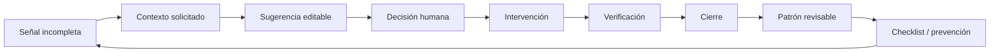

# IA para gestionar incidencias de obra y postventa inmobiliaria

## Caso de estudio de REPASO AI: del reto abierto a un producto evaluable

REPASO AI nació como respuesta independiente al Metrovacesa AI Challenge II. Este caso de estudio explica cómo se diseñó una demo funcional de **software para gestionar incidencias de obra, preentrega y postventa inmobiliaria con IA**. El objetivo no era producir una presentación sobre una idea hipotética, sino demostrar una tesis operativa:

> Una incidencia de calidad genera valor cuando entra con evidencia suficiente, se resuelve con responsabilidad visible, se cierra con verificación humana y deja una mejora que evita repetición.

El resultado es una demo pública funcional, un modelo económico editable, una propuesta de piloto, una arquitectura de evolución, una revisión de seguridad y un dossier de candidatura. Todo el material se diseñó para que un evaluador pudiera comprobar el razonamiento sin tener que confiar en una promesa.

## 1. Punto de partida

### Contexto observado

En construcción, preentrega y postventa, el dato inicial suele ser pobre: una fotografía aislada, un mensaje informal o una referencia incompleta. El equipo operativo invierte tiempo en reconstruir el contexto antes de poder tomar una decisión.

El problema no termina al crear un ticket. Continúa cuando:

- falta una vista general o una medición;
- dos incidencias parecen duplicadas, pero no lo son;
- el proveedor aporta una reparación sin contexto completo;
- el caso cambia de responsable;
- el cliente reabre la incidencia;
- una recurrencia no se convierte en prevención.

### Pregunta de producto

¿Cómo reducir ese trabajo sin delegar una decisión técnica, contractual o humana en un modelo?

La respuesta fue diseñar REPASO AI como **capa de inteligencia sobre los sistemas existentes**, no como sustituto inmediato del ticketing, ERP o repositorio documental.

## 2. Tesis de producto

La unidad de valor no es “ticket creado”. Es:

1. incidencia estructurada;
2. evidencia suficiente para revisar;
3. decisión técnica atribuible;
4. cierre confirmado;
5. aprendizaje reutilizable.

Esta definición llevó a un closed loop:

## 3. Decisiones que dieron forma al producto

### Demo determinista antes que IA remota

Para una evaluación pública, una llamada real a un modelo habría añadido latencia, coste, variabilidad, tratamiento de datos y gestión de secretos sin demostrar mejor el flujo de negocio. Se eligió una demo determinista que permite comprobar estados, controles y límites de forma reproducible.

La demo no se presenta como validación del rendimiento de un modelo multimodal. Ese trabajo pertenece al piloto.

### Sugerencias cualitativas, no falsa precisión

Se eliminaron porcentajes de confianza o similitud que podían parecer calibrados sin dataset de evaluación. El producto usa:

- evidencia suficiente o insuficiente;
- coincidencia cualitativa;
- razones visibles;
- abstención;
- edición y aprobación.

### Ninguna decisión irreversible en manos de la IA

La lógica de dominio impide:

- fusionar incidencias automáticamente;
- cerrar sin aprobación técnica;
- cerrar sin conformidad del cliente;
- convertir una scorecard en sanción o decisión de compra;
- presentar semejanza como causa común.

### Separación entre capacidad e intención

La interfaz y la documentación mantienen una matriz permanente:

- **hoy:** demo estática y sintética;
- **piloto:** usuarios y datos reales bajo alcance controlado;
- **futuro:** IA multimodal, identidad, persistencia e integraciones.

## 4. Diseño de la experiencia

La dirección visual buscó una “sala de control editorial” para calidad de construcción:

- tipografía serif para la tesis y sans-serif para operación;
- paleta mineral, grafito y aqua;
- fotografía documental de obra;
- bordes, tablas y ledgers en lugar de tarjetas SaaS repetitivas;
- jerarquía que permite entender la idea en segundos y auditarla en profundidad.

La interfaz evita gradientes “AI”, glassmorphism, estética cyberpunk y dashboards decorativos. Cada componente debe explicar una decisión, un estado o una evidencia.

## 5. Recorrido funcional

### Captura

El usuario recibe un caso sintético con una fotografía, ubicación y descripción. La UI deja claro que ninguna imagen sale del sitio.

### Análisis

La sugerencia organiza categoría, elemento, gremio y severidad. Cada campo puede corregirse. La explicación cita únicamente señales visibles y propone las comprobaciones que faltan.

### Duplicado

El sistema encuentra un candidato relacionado y explica la coincidencia. La persona puede vincular o mantener separados los casos. Nunca existe fusión automática.

### Flujo

Responsable, proveedor, SLA y siguiente gate quedan registrados. La evidencia de la actuación se conserva sin convertirla en certificación.

### Verificación

Una primera entrega incompleta se rechaza. El avance exige documentación suficiente, aprobación técnica y conformidad.

### Inteligencia preventiva

El cierre se vincula a un patrón emergente. La agrupación orienta una revisión y puede producir una checklist, pero no atribuye causalidad o responsabilidad.

## 6. Modelo económico

El ROI se implementó como calculadora, no como cifra de marketing. El usuario puede modificar:

- volumen anual;
- frecuencia de incidencias;
- ahorro administrativo;
- coste de personal;
- segundas visitas;
- tipo de reducción;
- coste de intervención;
- coste del proyecto;
- rampa de adopción.

El modelo distingue:

- beneficio bruto en régimen estable;
- ROI estable;
- ROI del primer año;
- payback;
- escenario no calculable;
- sensibilidad.

Las cifras incluidas son hipótesis sintéticas. El repositorio no afirma resultados obtenidos ni utiliza información interna de Metrovacesa.

## 7. Revisión adversarial

Antes de considerar terminada la candidatura se simuló la lectura de un revisor escéptico.

| Objeción probable                              | Respuesta incorporada                                                  |
| ---------------------------------------------- | ---------------------------------------------------------------------- |
| “La demo parece IA real, pero no lo es.”       | Etiqueta determinista y matriz hoy/piloto/futuro.                      |
| “Los porcentajes dan precisión artificial.”    | Indicadores cualitativos, razones y abstención.                        |
| “Los números parecen resultados.”              | Etiquetas de escenario, objetivo y supuesto.                           |
| “Es un ticket manager con otra interfaz.”      | Comparación explícita y closed loop preventivo.                        |
| “Los pesos de proveedor son arbitrarios.”      | Fórmula, pesos, evidencia y prohibición de decisión automática.        |
| “Una foto puede cerrar una incidencia.”        | Doble gate humano obligatorio.                                         |
| “El upload futuro abre riesgos.”               | Threat model y controles previos obligatorios.                         |
| “La IA puede obedecer un documento malicioso.” | Aislamiento, contenido no fiable, esquema validado y permisos mínimos. |
| “El ROI es demasiado optimista.”               | Inputs editables, sensibilidad y resultados negativos posibles.        |
| “No hay evidencia de calidad técnica.”         | Unit tests, E2E, accesibilidad, CI, audit y headers.                   |

La [revisión completa](security-review.md) conserva riesgos aceptados y condiciones antes de producción.

## 8. Seguridad por fase

### Demo pública

La versión desplegada:

- no acepta uploads;
- no procesa datos personales;
- no usa cookies;
- no tiene login;
- no llama a APIs;
- no contiene secretos;
- no incorpora trackers de terceros;
- se sirve como export estático.

Cloudflare Pages aplica CSP, HSTS, anti-framing, Permissions Policy, COOP, CORP y `nosniff`.

### Piloto

Antes de usar datos reales se requieren:

- base jurídica, minimización y retención;
- SSO y RBAC;
- autorización server-side;
- almacenamiento privado;
- auditoría append-only;
- residencia UE acordada;
- acuerdos con proveedores y responsables.

### Upload e IA real

Antes de abrir esa superficie:

- límites de tamaño;
- allowlist MIME;
- comprobación de magic bytes;
- renombrado seguro;
- escaneo antimalware;
- eliminación EXIF;
- URLs firmadas y temporales;
- aislamiento del documento;
- defensa contra prompt injection;
- salida estructurada validada;
- abstención;
- aprobación humana;
- evals con casos ciegos y monitorización.

## 9. Ingeniería y pruebas

La lógica de dominio se separó de la presentación:

- `lib/analysis.ts`: análisis sintético y abstención;
- `lib/workflow.ts`: actores, transiciones y gates;
- `lib/roi.ts`: escenarios, límites y fórmulas;
- `lib/demo-data.ts`: fixtures claramente sintéticos.

La verificación combina:

- Prettier;
- ESLint;
- TypeScript estricto;
- Vitest con cobertura mínima del 80 %;
- build estático;
- Playwright desktop y móvil;
- axe-core WCAG A/AA;
- `npm audit`;
- CodeQL y Dependabot en GitHub.

El objetivo no es declarar “software perfecto”, sino hacer que cada claim importante tenga una evidencia reproducible.

## 10. Candidatura y entrega

El paquete final incluyó:

- demo pública en Cloudflare Pages;
- dossier de candidatura;
- resumen ejecutivo;
- texto final del formulario;
- plan de piloto;
- checklist de envío;
- arquitectura;
- revisión de seguridad;
- repositorio reproducible.

Cuando el formulario presentó un problema de carga, se preparó una vía de contacto por correo con enlaces y adjuntos. Esa contingencia también siguió un principio del producto: conservar una entrega verificable, no depender de un único canal.

La candidatura fue presentada como iniciativa independiente. No existe afirmación de selección, aprobación o relación comercial.

## 11. Proceso humano + IA

Christian Calabrò dirigió la estrategia, la definición del problema, el criterio de producto, la revisión visual, la arquitectura de confianza y la aceptación final.

El proceso utilizó asistencia intensiva de IA para:

- síntesis y estructuración;
- revisión adversarial;
- generación y refactor de código;
- redacción y edición;
- preparación de tests;
- evaluación de coherencia;
- documentación;
- automatización de entregables.

La etiqueta interna con la que el autor documentó el modo de trabajo fue **“5.6 Sol Extra High”**. Se mantiene por trazabilidad del proceso creativo y de ingeniería; no se presenta como nombre comercial verificable ni como certificación del proveedor de modelos.

La regla central fue simple: la IA propone; una persona selecciona, cuestiona, verifica y responde por el resultado.

## 12. Resultado y siguiente paso

REPASO AI demuestra que una candidatura puede convertirse en un producto evaluable en lugar de quedarse en una presentación. El siguiente paso no es añadir más efectos visuales ni automatización indiscriminada. Es un piloto acotado capaz de responder:

1. ¿reduce el tiempo de estructuración?
2. ¿aumenta la suficiencia de la evidencia?
3. ¿reduce reasignaciones y reaperturas?
4. ¿mejora la trazabilidad del cierre?
5. ¿produce acciones preventivas útiles?
6. ¿lo hace sin degradar privacidad, criterio y responsabilidad?

Si las respuestas no se sostienen con baseline y muestra auditada, el producto debe cambiar o detenerse.

## Autor

[Christian Calabrò](https://github.com/Hiberius) diseña y construye productos AI-first completos: estrategia, experiencia, ingeniería, seguridad, evaluación y narrativa de mercado dentro del mismo sistema.

REPASO AI es una demostración pública de ese método.
