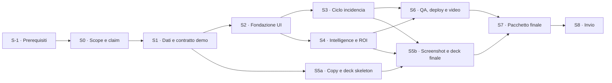

# REPASO AI — piano operativo per Metrovacesa AI Challenge II

**Versione:** 14 luglio 2026, 13:00 CEST  
**Scadenza operativa:** per prudenza, **15 luglio 2026 ore 23:59 CEST**; invio pianificato alle 17:00, retry entro le 19:30  
**Modalità di esecuzione:** due lane parallele nel repository locale; al momento non esistono commit né remote Git  
**Obiettivo:** presentare una candidatura credibile e verificabile, accompagnata da una demo pubblica essenziale che dimostri il ciclo completo “foto → classificazione assistita → assegnazione → prova prima/dopo → chiusura umana → prevenzione”.

## 1. Decisione di perimetro

Il formulario presenta il link a video/demo come opzionale, ma il sito afferma “No basta con diapositivas” e le basi richiedono una dimostrazione funzionale. Per evitare l'interpretazione più debole, questo piano tratta **demo funzionante o video dimostrativo stabile come requisito interno**. La demo completa descritta nel brief originale resta troppo ampia per essere costruita e verificata bene prima dell'invio.

Le fonti ufficiali sono incoerenti sul periodo: il sito alterna “hasta el 16 de julio” e “antes del 16 de julio”, mentre le basi riportano per errore “del 16 de julio hasta el 31 de agosto”. Finché gli organizzatori non confermano per iscritto, il 16 luglio non viene usato come buffer operativo.

Il piano adotta quindi due livelli:

1. **Entro il 15 luglio:** candidatura completa, deck di 10 slide, testi del formulario, ROI parametrico, architettura credibile, demo deterministica del percorso principale e video di backup.
2. **Dopo l’invio:** completamento delle funzioni da finalista in vista della presentazione del 21–30 settembre.

### Invarianti non negoziabili

- Tutta l’interfaccia visibile è in spagnolo professionale.
- Tutti i dati della demo sono sintetici e marcati come tali.
- L’AI propone; un tecnico valida. Nessuna diagnosi certificata e nessuna chiusura automatica.
- Il cliente o una simulazione esplicita della sua conformità precede la chiusura.
- Assunzioni ROI e risultati attesi sono sempre distinti dai dati reali.
- REPASO AI è presentato come intelligence layer integrabile, non come sostituto di PlanRadar, Autodesk, SAP o sistemi ticket esistenti.
- La demo funziona senza API key. L’integrazione AI reale è un percorso opzionale e server-side.

## 2. Cosa deve convincere il comitato

Il comitato dichiara di valutare problema/ROI/fattibilità, originalità, qualità tecnologica e UX, rigore di documentazione e demo, potenziale di crescita e strategia d'implantación. Ogni artefatto deve quindi provare sette tesi:

| Tesi                                     | Prova nella candidatura                                                                                                |
| ---------------------------------------- | ---------------------------------------------------------------------------------------------------------------------- |
| Esiste un problema operativo concreto    | perdita di informazioni, ticket incompleti, duplicati, riaperture, coordinamento fornitori e chiusure non verificate   |
| REPASO AI riduce lavoro e variabilità    | percorso guidato, classificazione assistita, richiesta di evidenze mancanti, SLA e checklist                           |
| Il valore è misurabile                   | simulatore ROI editabile e KPI di pilot prima/dopo                                                                     |
| La soluzione è implementabile            | demo locale deterministica, integrazione CSV/API/webhook, human review, hosting UE/SSO/audit come percorso enterprise  |
| La proposta è originale                  | il closed loop collega chiusura verificata, ricorrenze, prevenzione e scorecard, invece di replicare un ticket manager |
| Tecnologia e UX sono solide              | percorso guidato, accessibilità, test automatici e fallback senza API key                                              |
| Documentazione e crescita sono credibili | fonti tracciate, piano pilot, roadmap enterprise e strategia di integrazione graduale                                  |

## 3. Demo minima vincente

La demo deve sembrare un prodotto coerente, ma può comprimere i tredici schermi del brief in sei percorsi:

1. **Landing + demo guidata** — proposta di valore, dati simulati e avvio senza login.
2. **Nueva incidencia** — foto campione, descrizione e ubicazione; risultato AI strutturato ed editabile; richiesta di una prova aggiuntiva quando la confidenza è bassa.
3. **Incidencia INC-0241** — possibile duplicato, assegnazione, SLA, audit timeline e stati del workflow.
4. **Verificación** — confronto prima/dopo, evidenza incompleta, approvazione tecnica e conformità cliente simulata.
5. **Inteligencia** — pattern ricorrente, azione preventiva e scorecard fornitore sostenuta da incidenti tracciabili.
6. **Impacto** — ROI parametrico, pilot di 12 settimane, integrazione e fonti/metodologia.

### Fuori perimetro prima dell’invio

- autenticazione, ruoli reali e persistenza multiutente;
- upload e analisi AI live obbligatoria;
- input voce/video e planimetria interattiva avanzata;
- integrazioni reali con SAP, PlanRadar, Autodesk o Entra ID;
- computer vision addestrata, segmentazione o dataset proprietario;
- tutte le viste amministrative secondarie;
- app mobile nativa e notifiche reali.

Queste funzioni possono essere rappresentate nella roadmap, senza dichiararle già operative.

## 4. Sequenza di costruzione



### Lane e responsabilità

- **Lane prodotto — agente implementazione:** S2, S3, S4 e S6.
- **Lane candidatura — agente contenuti/deck:** S5a e S5b.
- **Gate — primary agent + candidato:** S-1, S0, S1, S7 e S8.

Le lane prodotto e candidatura procedono in parallelo dopo S1. Se è disponibile un solo esecutore, si elimina il grafico secondario, si riduce il dataset a 8 incidenti e il deck usa un solo screenshot per fase; la scadenza non si sposta.

## 5. Passi eseguibili

### S-1 — Risolvere prerequisiti e ambiguità esterne

**Finestra:** 14 luglio, 13:00–13:30  
**Dipendenze:** nessuna  
**Risultato:** accessi, autorità e fallback chiariti prima dell'implementazione.

**Stato verificato:** Node `22.23.1`, npm `10.9.8` e Vercel CLI sono presenti; Vercel non è autenticato; Git non ha identità configurata; il repository non ha remote né commit.

**Attività:**

- il candidato autorizza o nega esplicitamente un deploy pubblico e completa l'accesso Vercel se autorizzato;
- scegliere e autorizzare un hosting video raggiungibile tramite link non indicizzato; verificare che il link sia apribile in incognito senza account;
- aprire il formulario senza inviare, verificare tipo/numero allegati e accessibilità dell'upload da 50 MB;
- chiedere agli organizzatori conferma scritta su cutoff e sufficienza di demo URL/video;
- nominare un revisore umano oppure approvare un gate in due passaggi indipendenti con checklist firmata;
- confermare nome/email Git prima di creare commit locali;
- fissare npm come package manager e Node 22 come runtime.

**Verifica:** nessuna credenziale o autorizzazione necessaria resta implicita.  
**Criterio di uscita:** deploy autorizzato o hosting video autorizzato; percorso di invio verificato in incognito.  
**Rollback:** senza accesso Vercel si registra la demo locale e la si pubblica sull'hosting video già approvato; senza risposta degli organizzatori resta valida la hard deadline del 15 luglio.

### S0 — Congelare storia, scope e claim

**Finestra:** 14 luglio, 13:30–14:15  
**Dipendenze:** S-1  
**Risultato:** una sola narrativa condivisa prima di scrivere codice o slide.

**Contesto per chi esegue:** REPASO AI trasforma input multimodali in incidenti completi e verificabili, ma il differenziale è il closed loop che alimenta prevenzione e valutazione fornitori. Per prudenza si invia il 15 luglio; la candidatura premia ROI, implementabilità, qualità, rigore e crescita.

**Attività:**

- fissare la one-liner in spagnolo e i tre ambiti: Construcción y Obra, Post-venta, Eficiencia de procesos/costes;
- approvare i sei percorsi della demo minima;
- creare un registro claim con colonne `claim`, `fonte`, `tipo` (reale/accademico/assunzione), `artefatto`;
- eliminare dal testo ogni promessa non dimostrabile;
- confermare nome del candidato, dimensione reale del team e recapiti per il formulario.

**Verifica:** ogni numero nel deck deve avere una fonte o la dicitura “modelo ilustrativo”.  
**Criterio di uscita:** nessuna decisione di prodotto essenziale resta aperta.  
**Rollback:** se un claim non è verificabile in meno di 20 minuti, rimuoverlo o convertirlo in ipotesi esplicita.

### S1 — Definire dati sintetici e contratto del racconto

**Finestra:** 14 luglio, 14:15–15:15  
**Dipendenze:** S0  
**Risultato:** fixture deterministiche condivise da demo, test, screenshot e deck.

**Attività:**

- definire 3 promozioni fittizie, 3 fornitori e 12–20 incidenti sintetici;
- creare un caso protagonista relativo a sigillatura/finestra con duplicato, SLA e prove prima/dopo;
- fissare categorie, severità, stati e criteri scorecard;
- implementare schema Zod dell’analisi e degli eventi audit;
- fissare gli input ROI, includendo tasso baseline di seconde visite, riduzione relativa vs punti percentuali e ramp-up del pilot;
- preparare immagini campione con origine e licenza chiare oppure generate ad hoc.

**Verifica:** stesso seed = stessi dati, stesse metriche e stesso percorso guidato.  
**Criterio di uscita:** nessuna pagina inventa valori autonomamente.  
**Rollback:** ridurre il dataset, non il numero di stati necessari al closed loop. Creare un checkpoint Git locale `checkpoint/s1-data-contract` o, se l'identità Git non è stata risolta, uno snapshot ZIP datato.

### S2 — Creare fondazione tecnica e design system

**Finestra:** 14 luglio, 15:15–17:15  
**Dipendenze:** S1  
**Risultato:** applicazione Next.js navigabile e deployable.

**Attività:**

- inizializzare con npm e Node 22: Next.js App Router, TypeScript strict, Tailwind, componenti accessibili, Recharts, Zod, Vitest e Playwright;
- definire layout mobile-first, palette navy/bianco/grigio caldo/turchese e tipografia;
- creare navigazione, banner “Datos simulados para demostración”, error boundary e stati vuoti;
- predisporre `DEMO_MODE`, `.env.example` e route server-side opzionale per OpenAI, senza renderla dipendenza della demo;
- aggiungere README minimo, `THIRD_PARTY_NOTICES.md`, registro asset/licenze e struttura `docs/`;
- aggiungere `npm run verify` come comando unico per format check, lint, typecheck, unit test e build.

**Verifica:**

```bash
npm run lint
npm run typecheck
npm run build
```

**Criterio di uscita:** tutte le sei destinazioni sono raggiungibili e il build di produzione passa.  
**Rollback:** rimuovere librerie non indispensabili e usare componenti locali semplici. Conservare l'ultimo build verde nel checkpoint `checkpoint/s2-foundation`.

### S3 — Implementare il closed loop dell'incidenza

**Finestra:** 14 luglio, 17:15–21:00  
**Dipendenze:** S2  
**Risultato:** percorso dimostrativo principale completo in 60–90 secondi.

**Attività:**

- implementare cattura con caso campione e campi di ubicazione;
- mostrare analisi AI strutturata, modificabile e marcata come suggerimento;
- mostrare astensione/richiesta evidenza quando la confidenza è bassa;
- implementare duplicato con azioni `vincular`, `fusionar` e `mantener separado`, mai automatiche;
- implementare dettaglio con owner, fornitore, SLA, timeline e workflow;
- implementare confronto prima/dopo, validazione tecnica, conformità cliente e riapertura motivata;
- aggiungere un test unitario dello schema e un E2E del percorso guidato.

**Verifica:**

```bash
npm test -- --run
npx playwright test
```

**Criterio di uscita:** una persona nuova completa il percorso senza spiegazioni esterne e vede chiaramente dove interviene l'essere umano.  
**Rollback:** usare una sola incidenza protagonista e rendere le azioni deterministiche; non simulare backend complessi. Conservare l'ultimo E2E verde nel checkpoint `checkpoint/s3-closed-loop`.

### S4 — Implementare intelligence, scorecard, ROI e pilot

**Finestra:** 15 luglio, 08:30–11:00  
**Dipendenze:** S2; usa file/route separati da S3  
**Risultato:** prova di valore aziendale oltre il ticket individuale.

**Attività:**

- creare una dashboard compatta con KPI, Pareto e pattern emergente;
- trasformare il pattern in una checklist preventiva con audit event;
- creare scorecard fornitore sui cinque criteri richiesti, collegando ogni punteggio a evidenze sintetiche;
- implementare il simulatore ROI editabile con tasso baseline, tipo di riduzione e ramp-up, più disclaimer permanente;
- aggiungere il piano pilot: 1 promozione, circa 150 abitazioni, 12 settimane, baseline e KPI target;
- aggiungere architettura d’integrazione CSV/API/webhook e roadmap enterprise senza claim di implementazione già completata.

**Verifica:** test unitari delle formule e due scenari distinti. Lo scenario alto (~203k € lordo, ~171% ROI, 4,4 mesi) assume 10 punti percentuali di seconde visite evitati su tutti i ticket e payback a regime. Lo scenario prudente assume baseline 20% e riduzione relativa 10%: ~102k € lordo, ~27k € netto, ~36% ROI e ~8,8 mesi a regime. Il primo anno applica un ramp-up separato per il pilot.  
**Criterio di uscita:** ogni KPI è riconducibile a dati simulati, target pilot o assunzione.  
**Rollback:** mantenere un solo grafico forte e una tabella leggibile; eliminare visualizzazioni decorative. Conservare l'ultimo build verde nel checkpoint `checkpoint/s4-impact`.

### S5a — Scrivere copy, formulario e deck skeleton

**Finestra:** 14 luglio, 15:15–18:30, in parallelo con S2–S3  
**Dipendenze:** S1  
**Risultato:** narrativa e struttura complete, ancora senza screenshot finali.

**Struttura deck, 10 slide:**

1. titolo, tagline e one-liner;
2. problema operativo e perché ora;
3. circuito chiuso REPASO AI;
4. demo: dalla foto alla segnalazione validata;
5. verifica della riparazione e chiusura umana;
6. intelligence preventiva e scorecard fornitori;
7. ROI parametrico e assunzioni;
8. pilot di 12 settimane e KPI;
9. architettura, integrazione, sicurezza e governance;
10. differenziazione, roadmap e call to action.

**Attività:**

- scrivere deck in spagnolo con fonti in nota e massimo un messaggio centrale per slide;
- preparare testi esatti del formulario e placeholder per link demo/video;
- produrre script spagnolo da 90 secondi e 3 minuti;
- preparare le note delle fonti, le formule ROI e la sezione limitazioni;
- creare il sorgente PPTX con segnaposto espliciti per 3–4 screenshot reali.

**Verifica:** anche senza screenshot, il deck comunica problema, soluzione, ROI, fattibilità, qualità, rigore e crescita.  
**Criterio di uscita:** deck skeleton di 10 slide, testo formulario e due script sono presenti in `submission/`.  
**Rollback:** ridurre il testo, non eliminare fonti, assunzioni o strategia di implantación.

### S5b — Finalizzare screenshot e presentazione

**Finestra:** 15 luglio, 11:00–14:00, in parallelo con S6  
**Dipendenze:** S3, S4 e S5a  
**Risultato:** presentazione finale autosufficiente e pronta all'upload.

**Attività:**

- inserire 3–4 screenshot reali della demo, non mockup incoerenti;
- sostituire il ROI singolo con scenario prudente, scenario alto e assunzioni visibili;
- controllare titolarità e licenza di ogni immagine, icona, font e dipendenza mostrata;
- esportare un solo PDF sotto 50 MB come allegato di invio;
- conservare il PPTX modificabile localmente, salvo conferma che il form accetti più file.

**Verifica:** il PDF esportato è leggibile pagina per pagina, le fonti sono visibili e nessuna metrica illustrativa appare come risultato conseguito.  
**Criterio di uscita:** `submission/repaso-ai-metrovacesa.pdf`, sorgente PPTX, `formulario-es.md` e script sono pronti.  
**Rollback:** mantenere screenshot statici coerenti e rimuovere effetti/asset non essenziali; non eliminare la prova funzionale separata.

### S6 — QA, accessibilità, deploy e prova generale

**Finestra:** 15 luglio, 11:00–14:00, in parallelo con S5b  
**Dipendenze:** S3, S4 e autorizzazione/fallback definiti in S-1  
**Risultato:** demo verificata, video di backup e, se autorizzato, URL HTTPS stabile.

**Attività:**

- eseguire formattazione, lint, typecheck, unit test, smoke E2E e build;
- controllare viewport mobile e desktop, contrasto, tastiera e testi spagnoli;
- verificare che la demo funzioni in incognito e senza API key;
- verificare privacy, limiti upload, messaggi di errore e assenza di dati personali;
- pubblicare su Vercel solo dopo autorizzazione esplicita e prova locale verde;
- salvare screenshot finali, registrare sempre un video non montato di 90 secondi e pubblicarlo sull'hosting autorizzato;
- provare URL demo, se presente, e link video su un dispositivo o profilo browser differente.

**Verifica:**

```bash
npm run verify
npx playwright test
```

**Criterio di uscita:** tutti i controlli passano; esiste un video riproducibile e, se autorizzato, l'URL pubblico restituisce il percorso guidato completo.  
**Rollback:** se il deploy è instabile, inviare il video stabile e mantenere l'URL fuori dal formulario. Tornare al checkpoint verde più recente, senza patch d'emergenza non verificate.

### S7 — Congelare il pacchetto di invio

**Finestra:** 15 luglio, 14:00–17:00  
**Dipendenze:** S5b e S6  
**Risultato:** release candidate della candidatura.

**Attività:**

- controllare nomi, email, dimensione reale del team e tre aree;
- aprire e rileggere il PDF esportato pagina per pagina;
- provare il link demo, se presente, e il link video da rete/dispositivo differente;
- verificare video, asset ledger, `THIRD_PARTY_NOTICES.md`, titolarità IP e assenza di contenuti confidenziali o personali;
- ricordare che le basi autorizzano ampia diffusione dei materiali presentati;
- creare checksum, tag/checkpoint locale e copia ZIP di sicurezza del pacchetto;
- predisporre un registro finale di fonti, assunzioni e limitazioni.

**Criterio di uscita:** un revisore nominato non trova blocchi critici; se non disponibile, due passaggi indipendenti della checklist, distanziati di almeno 30 minuti, sono firmati e archiviati.  
**Rollback:** correggere solo errori fattuali, link rotti o problemi di leggibilità; evitare nuove feature.

### S8 — Inviare con buffer

**Finestra:** invio 15 luglio 17:00–18:00; retry tecnico fino alle 19:30; buffer passivo fino alle 23:59  
**Dipendenze:** S7  
**Risultato:** candidatura ricevuta e verificabile.

**Attività:**

- compilare il formulario ufficiale;
- caricare il PDF sotto 50 MB; conservare il PPTX localmente salvo conferma esplicita che il form accetti più allegati;
- aggiungere il link demo solo se stabile e il link video in ogni caso;
- salvare screenshot del riepilogo, timestamp e conferma email;
- non pianificare alcuna attività sul 16 luglio.

**Criterio di uscita:** esiste una prova locale della ricezione.  
**Rollback:** se il form fallisce, contattare subito l’indirizzo ufficiale allegando pacchetto, errore e timestamp; non considerare l’email un invio valido senza conferma.

## 6. Manifest per esecuzione cold-start

Un agente nuovo deve trovare questi artefatti senza ricostruire il contesto:

| Percorso previsto                                  | Contenuto                                                    |
| -------------------------------------------------- | ------------------------------------------------------------ |
| `package.json`                                     | Node 22, npm scripts e `npm run verify`                      |
| `app/`                                             | sei percorsi della demo e route server-side AI opzionale     |
| `lib/demo-data.ts`                                 | seed e fixture sintetiche condivise                          |
| `lib/schemas.ts`                                   | schemi Zod per analisi, incidente e audit event              |
| `lib/roi.ts`                                       | formule, scenari e ramp-up                                   |
| `tests/` e `e2e/`                                  | unit test e percorso guidato Playwright                      |
| `public/demo/`                                     | immagini sintetiche con origine registrata                   |
| `docs/claims-ledger.md`                            | claim, fonte, tipo e artefatto d'uso                         |
| `docs/demo-script.md`                              | script spagnolo da 90 secondi e 3 minuti                     |
| `THIRD_PARTY_NOTICES.md` e `docs/assets-ledger.md` | dipendenze, asset, licenze e titolarità                      |
| `submission/`                                      | PDF da inviare, PPTX sorgente, formulario, video e checklist |

Lo stato valido più recente è identificato da checkpoint Git locali dopo S1, S2, S3 e S4; se Git resta privo di identità, usare snapshot ZIP datati nella cartella `checkpoints/`.

## 7. Roadmap dopo la candidatura

### Fase A — Demo da finalista, 17 luglio–14 agosto

- completare tutte le schermate secondarie;
- aggiungere analisi multimodale reale dietro feature flag;
- migliorare upload, planimetria, duplicate detection e documenti;
- introdurre persistenza, ruoli, audit immutabile simulato e rate limiting reale;
- validare categorie e workflow con 2–3 professionisti del settore.

### Fase B — PoC pilot-ready, 17 agosto–15 settembre

- definire connettori CSV/API/webhook e mapping con un sistema target;
- creare dataset e protocollo di human review;
- definire baseline, telemetria e calcolo KPI;
- preparare threat model, retention, EU hosting e percorso Entra ID;
- sostituire le assunzioni ROI con range e scenari concordati.

### Fase C — Presentazione al comitato, 16–20 settembre

- prova generale di 3 minuti e variante da 10 minuti;
- demo offline di sicurezza;
- Q&A su ROI, adozione, integrazione, privacy e responsabilità tecnica;
- proposta economica e piano di pilot con responsabilità, milestone e criteri go/no-go.

## 8. Rischi principali e contromisure

| Rischio                                | Probabilità / impatto | Contromisura                                                                             |
| -------------------------------------- | --------------------- | ---------------------------------------------------------------------------------------- |
| Scope eccessivo                        | alta / critica        | sei percorsi, dati locali, niente backend reale obbligatorio                             |
| Demo instabile                         | media / alta          | modalità deterministica, E2E, URL primario e video obbligatorio di backup                |
| Claim non sostenuti                    | media / critica       | claims ledger e separazione fonte/assunzione/target                                      |
| ROI contestabile                       | alta / alta           | baseline esplicita, riduzione relativa vs punti percentuali, ramp-up e sensitivity range |
| Prodotto percepito come ticket manager | media / alta          | mostrare closed loop, prevenzione e scorecard entro il primo minuto                      |
| Dipendenza da AI generativa            | media / media         | demo senza chiave, schema validato, astensione e human review                            |
| IP o materiali divulgabili             | media / alta          | asset ledger, notices, titolarità e controllo contenuti confidenziali                    |
| Accesso deploy/form                    | media / critica       | S-1, video locale di backup e prova anticipata del form                                  |
| Invio tardivo                          | media / critica       | invio 15 luglio ore 17:00, retry fino alle 19:30, nessun buffer sul 16                   |

## 9. Regole di mutazione del piano

- Un passo può essere **ridotto** solo preservando gli invarianti e il percorso closed loop.
- Una nuova feature entra prima dell'invio solo se sostituisce una feature di pari costo e migliora direttamente uno dei sette criteri del jurado.
- Se un passo slitta di oltre 60 minuti, tagliare prima animazioni, grafici secondari e integrazione AI live; non tagliare il video di backup.
- Dopo le 14:00 del 15 luglio vige feature freeze: solo correzioni, fonti, accessibilità, deploy e packaging.
- Ogni deviazione deve annotare: motivo, impatto sulla scadenza, artefatto sacrificato e nuovo criterio di uscita.

## 10. Fonti ufficiali usate per la pianificazione

- [Sito ufficiale Metrovacesa AI Challenge II](https://metrovacesachallenge.ai/) — requisiti, criteri, calendario, campi del formulario e limite di 50 MB.
- [Condizioni generali ufficiali](https://metrovacesachallenge.ai/condiciones-generales/) — demo funzionale, criteri completi del jurado, proprietà intellettuale e diritti di diffusione; contiene un periodo d'iscrizione incoerente con il sito.
- [Annuncio ufficiale Metrovacesa, 25 maggio 2026](https://metrovacesa.com/blog/metrovacesa-impulsa-la-aplicacion-real-de-la-ia-en-el-sector-promotor-con-la-segunda-edicion-de-ai-challenge) — scadenza del 16 luglio e priorità a impatto operativo, ROI e integrazione.

## 11. Prossima azione consigliata

Eseguire immediatamente **S-1, S0 e S1**, poi avviare in parallelo fondazione demo e deck skeleton. Il primo checkpoint deve essere alle **15:15 del 14 luglio**: autorizzazioni/fallback, one-liner, claim ledger, caso protagonista, dataset e formule ROI congelati.
